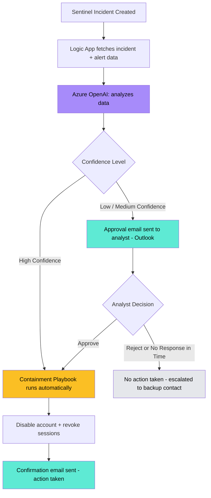

# 🤖 Cloud SIEM & SOAR Lab v2 – AI-Augmented Incident Triage & Containment

> Builds on my [Cloud SIEM & SOAR Lab v1](https://github.com/Aziz-NG/Cloud-SIEM-SOAR-Lab-Azure-Security-Project/blob/main/Cloud%20SIEM%20%26%20SOAR%20Lab%20%E2%80%93%20Azure%20Security%20Project.md) — same Sentinel detections, same Entra ID telemetry, same underlying Logic Apps playbooks. This version adds an **Azure OpenAI judgment layer** in front of incident response, so the analyst gets a plain-language triage summary instead of raw alert fields, and account containment only fires automatically when the AI is confident it's a real threat.

---

# 📌 Why This Version Exists

v1 proved the SOC pipeline end-to-end: detections fire, analysts get notified, high-severity incidents trigger automatic account containment. It works — but severity alone can't tell the difference between a real attacker and a legitimate user having a bad day. Both detection rules in v1 (Brute Force and Impossible Travel) are known to produce false positives in real environments — a bad password day, a business trip, a VPN — and in v1, both would result in the account being disabled automatically, with no adjudication step in between.

v2 doesn't change the detections or rebuild the playbooks. It adds one thing: **a judgment step, powered by an LLM, between "incident detected" and "account disabled."**

---

# 🏛️ Architecture

*Everything left of the AI step is unchanged from v1 — same detections, same incident creation. Everything the AI produces feeds into a decision point that either lets the existing containment playbook run automatically (high confidence) or pauses for a one-tap human approval by email (anything less than high confidence). Either way, once containment actually executes, a confirmation email fires so there's always a record of what was done and when.*

> 

---

# 🎯 What the AI Actually Does

For every incident, Azure OpenAI reads the incident and alert data and returns a structured judgment:

* **Severity justification** — a plain-language explanation of why this incident looks the way it does
* **Confidence** (high / medium / low)
* **False-positive likelihood** (low / medium / high)
* **Recommended action**

Example of the difference this makes for the analyst:

**Without AI (v1):** *"Incident: Impossible Travel Alert. Severity: High. UserPrincipalName: jdupont@company.com."*

**With AI (v2):** *"This incident shows a sign-in from Montreal followed by a sign-in from Paris 5 hours later. Confidence: medium. This timing is plausible for a transatlantic flight, so false-positive likelihood is medium-high. Recommend verifying with the user before taking any containment action."*

**What the AI does NOT do:** it never disables an account or revokes sessions itself. It only produces the judgment above. Execution still happens exclusively through the Logic Apps playbooks — either automatically (when confidence is high) or after a human clicks approve (when it isn't). This boundary matters: an LLM that both judges *and* acts on an irreversible action like account containment introduces reliability and manipulation risks that aren't worth the convenience. Keeping the AI as a recommender, and the playbook as the sole executor, avoids that.

> 

---

# ⚡ How It Changes Incident Response

## 🔔 Notifications — now AI-summarized

Instead of raw incident fields, the analyst's email alert now includes the AI's plain-language summary and confidence level, grounded in the actual incident data (account, IP, and — where applicable — the specific attempt count) rather than just the rule's static title and severity.

## 🚫 Account Containment — now confidence-gated

* **AI confidence is high** → containment proceeds automatically, exactly as it did in v1 (account disabled, sessions revoked)
* **AI confidence is low or medium** → instead of disabling the account immediately, the analyst receives an **Outlook approval email** summarizing the incident and the AI's reasoning, with built-in **Approve** / **Reject** buttons — one click from the inbox, not a manual investigation

> 

* **If the analyst doesn't respond in time** → no action is taken, and it escalates to a backup contact instead. The system deliberately does *not* auto-approve on timeout — a stalled response should never result in an unattended account lockout.
* **Whenever containment actually executes** — whether automatically (high confidence) or after analyst approval (low/medium confidence) — a **confirmation email** fires immediately after, stating the incident number, the account affected, the exact actions taken (disabled + sessions revoked), the timestamp, and whether it was automatic or analyst-approved. This closes a gap v1 already covered (v1's validation included a confirmation email after containment) that needed to carry forward into v2 rather than get dropped in the redesign.

---

# 🛡️ Threat Modeling — what's new for the AI layer

| Category | Risk | How it's handled |
|---|---|---|
| Prompt Manipulation | Alert data (usernames, hostnames, sign-in details) could contain text designed to influence the AI's judgment | The AI is explicitly instructed to treat all incident data as information to analyze, never as instructions to follow |
| Over-reliance on AI | An analyst might approve a containment action without really reading the AI's reasoning | The approval email always includes the AI's reasoning alongside the recommendation, not just an Approve/Reject button |
| Availability | A stalled/unanswered approval could leave a real threat unresolved | Timeout escalates to a backup contact rather than silently doing nothing |

---

# 🎯 Validation — proving the AI adds real value

The scenario that matters most for this version isn't "does the AI work," it's "does it prevent the mistake v1 would have made":

| Scenario | v1 Behavior | v2 Behavior |
|---|---|---|
| **Legitimate business travel, two sign-ins hours apart** | **Account disabled — a false-positive lockout** | **AI flags medium/low confidence → analyst approval requested → account stays active pending a human decision** |

That row, captured as a before/after screenshot, is the core proof point of this whole version: the AI didn't just add commentary, it prevented a real operational mistake v1 would have made.

**Note on the high-confidence path:** the auto-containment side of the confidence gate (AI assesses high confidence → containment fires automatically, no approval needed) is real, working logic in the pipeline — the same `Confidence_Gate` condition handles both outcomes. However, an attempt to specifically demonstrate it with an extreme brute-force test (a large number of failed attempts in a short window) did not reliably push the AI to a "high" confidence result, even after adding the actual attempt count to its input and tuning the prompt's calibration guidance. This suggests either the threshold guidance needs further tuning, or the model is (reasonably) staying cautious without additional corroborating signals beyond attempt count alone. This is documented honestly here rather than presented as a completed test — see Known Limitations below.

> img

---

# 📋 Governance Note

This version treats the AI strictly as a decision-support tool, with a human required for any irreversible action — an approach that lines up with NIST's AI Risk Management Framework, which calls for human oversight on consequential automated decisions. Worth stating plainly in an interview: the design choice not to let AI execute containment directly was deliberate, not a limitation I ran out of time to fix.

---

# 🚀 Key Takeaways

- **Same foundation, smarter response** — v1's detections and playbooks are untouched; v2 only adds judgment ahead of the response decision
- **AI as recommender, not actor** — the LLM never executes an irreversible action; it only informs the decision
- **Measurable, not just theoretical** — the false-positive-prevention scenario gives a concrete, demonstrable before/after rather than a claim of "smarter security"

---

# 📌 Conclusion

v2 targets the one real weak point in v1's design: a detection firing high severity isn't the same as a detection being right. Adding an AI judgment step closes that gap without touching what already worked, and without handing an LLM authority it shouldn't have over identity containment. The result is faster, better-informed responses to real threats, and fewer legitimate users getting locked out along the way.

---

# ⚠️ Known Limitation & Future Work

In the interest of accuracy, this version does not (yet) demonstrate or fully resolve:

- **High-confidence auto-containment wasn't reliably reproduced in testing.** The logic exists and is the same code path as the approval flow, but an extreme brute-force test (elevated failed-attempt count, fed directly to the AI) did not consistently produce a "high" confidence result. Next step would be further prompt calibration, or accepting that the model's caution here may itself be reasonable behavior worth keeping rather than "fixing."

